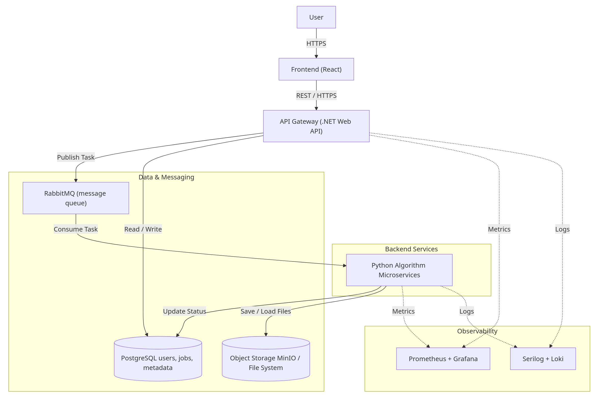
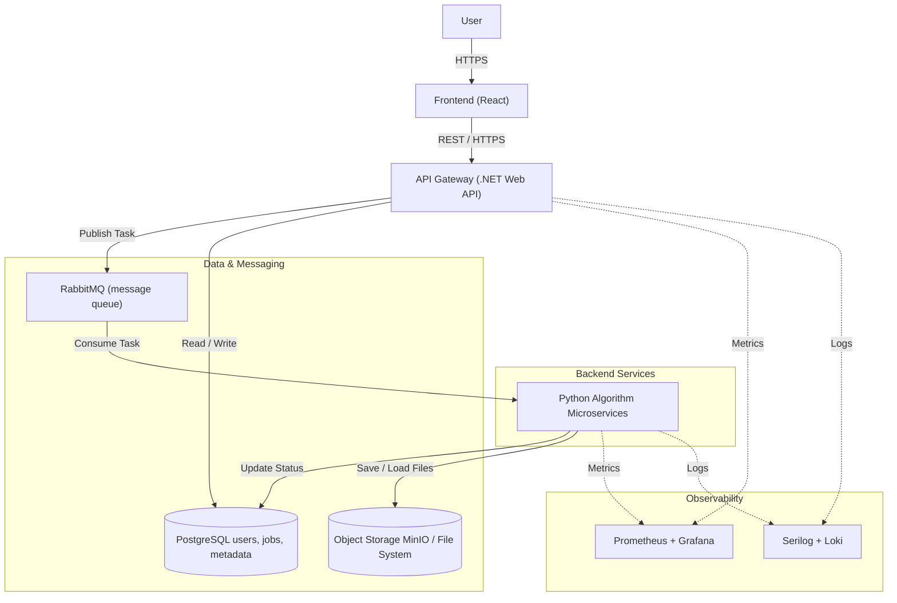

I was sent this "architecture":

## Check all container statuses
> docker compose -f infrastructure/docker-compose.yml ps

## Test API Gateway health
> curl http://localhost:5000/health

## Test Frontend
> curl http://localhost:3000/health
### Login (default see [.env](.env) if changed): admin / admin123

## Access Grafana (after ~60 seconds)
> Open: http://localhost:3001
### Login (default see [.env](.env) if changed): admin / admin123

## Core Services (Always Deployed)
| Service        | Port         | Description                                       |
| -------------- | ------------ | ------------------------------------------------- |
| frontend       | 3000         | React/Vite SPA with Nginx reverse proxy           |
| gateway        | 5000         | .NET 10 Web API with Swagger/OpenAPI              |
| python-service | 8000         | Python algorithm microservice (RabbitMQ consumer) |
| postgres       | 5432         | PostgreSQL 15 for users, jobs, metadata           |
| rabbitmq       | 5672 / 15672 | RabbitMQ 3 with management UI                     |
| minio          | 9000 / 9001  | MinIO object storage and web console              |

## Observability Services (Optional Profiles)
| Service           | Port | Profile       | Description                          |
| ----------------- | ---- | ------------- | ------------------------------------ |
| prometheus        | 9090 | metrics       | Metrics collection and alerting      |
| loki              | 3100 | logging       | Log aggregation system               |
| grafana           | 3001 | observability | Unified dashboards and visualization |
| cadvisor          | 8080 | metrics       | Container resource metrics           |
| postgres_exporter | 9187 | metrics       | PostgreSQL metrics exporter          |

#### *Ports are defined in [.env](../.env)*

### Show help
> ./infrastructure/setup.sh -h

### Full deployment (app + observability)
> ./infrastructure/setup.sh

### App only (no monitoring, minimal resources)
> ./infrastructure/setup.sh --no-observability

### Metrics only (Prometheus + exporters, no Grafana/Loki)
> ./infrastructure/setup.sh -m

### Logging only (Loki, no metrics/Grafana)
> ./infrastructure/setup.sh -l

### Clean start (remove volumes + containers)
> ./infrastructure/setup.sh -c

### Skip build (use cached images)
> ./infrastructure/setup.sh -n

### Combine options
> ./infrastructure/setup.sh -c -m    # Clean + metrics only